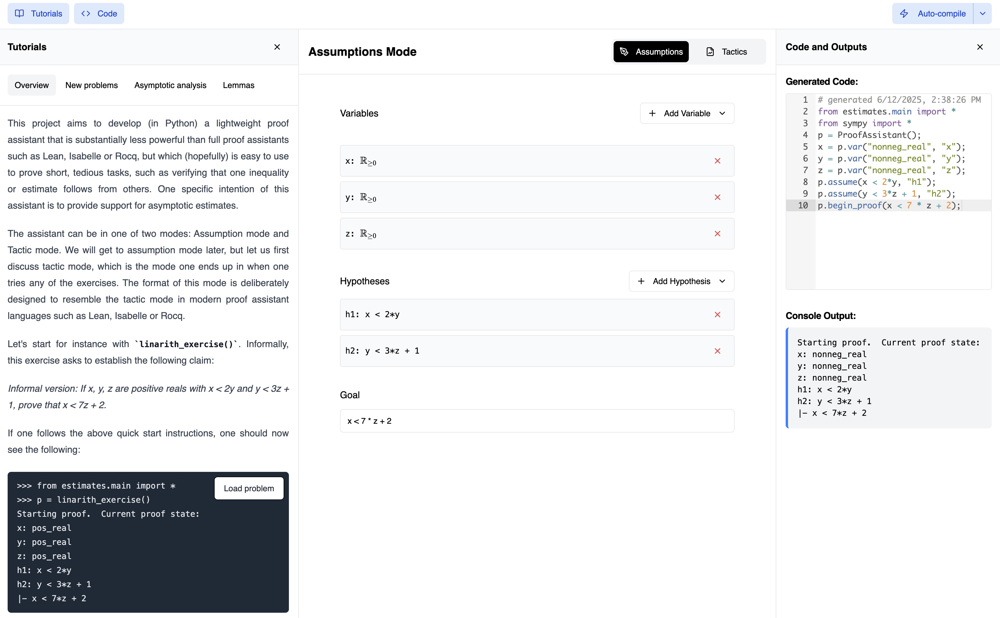

# Estimates in the browser
Browser-based IDE for writing proofs with the [`estimates`](https://github.com/teorth/estimates) library, currently available at https://math.llm.dev.



## How it works
This is supported by three pieces of work:
1. [z3 wheel](https://github.com/Z3Prover/z3/issues/7418) pyodide-compatible z3 wheel released by the Microsoft team
2. [estimates-pyproject.toml](estimates-pyproject.toml) pure-python `estimates` wheel
3. [ui](ui) `vite` app that loads the uses Pyodide to serve `estimates` wheel, after injecting the `z3` dependency

### Building estimates as a wheel
1. Pyodide works with python 3.12 while `estimates` is built by default with 3.13
2. Estimates has two dependencies: `z3` and `sympy`
3. With the work above we can shim `z3` and Pyodide loads `sympy` by default
In order to build a Pyodide-compatible version of `estimates`, we replace the default `pyproject.toml` in `estimates` with `estimates-pyproject.toml`. See [`.github/workflows/pages.yml`](.github/workflows/pages.yml) for the full build pipeline.

This is then loaded in `z3-pyodide-shim/ui/src/features/pyodide/loader.ts` from the jsdeliver CDN.

#### How this can break
If there are upstream dependency changes in `estimates`, this process of building new wheels may fail and in turn kill future builds in this repository.

#### How you can help this work
It's likely worth figuring out a better way to manage this build process, as right now the upstream `estimates` repo has no visibility into the fact that meaningful changes to its dependency patterns would in turn harm this repo.

### Vite app
With pure python `z3` and `estimates` wheels, we can now load them in any Pyodide-compatible environment. In the folder `ui` we have a vite app that loads the website at [`https://math.llm.dev`](https://math.llm.dev).

You can run this with the following:
```
cd ui
npm run install
npm run dev
```

#### How this can break
This can break in all the classic ways that web apps can break! Any and all contributions are welcome.

## Contributing
Please review the issues tagged with `good-first-issue` or submit an issue of your own! This is a very early-stage project, so contributors are actively encouraged.